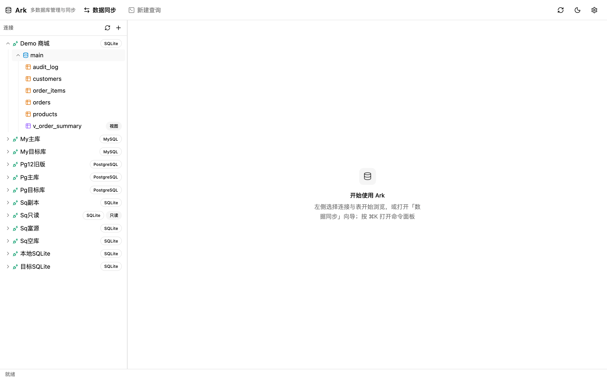

# 教程 2：对象浏览

左侧「连接」树是所有功能的入口，层级为 **连接 → 数据库 →（仅 PostgreSQL）schema → 表/视图**，逐级懒加载。

## 树的层级与图标

| 层级 | 图标 | 说明 |
|---|---|---|
| 连接 | 🔌 插头（绿） | 旁带方言 Badge（PostgreSQL / MySQL / SQLite）；只读连接额外显示「只读」Badge |
| 数据库 | 🛢 数据库（蓝） | SQLite 固定为 `main` |
| schema | 📚 层（紫） | 仅 PostgreSQL（默认 `public`）；MySQL / SQLite 无此层 |
| 表 | 表格（琥珀） | 单击即打开数据网格 |
| 视图 | 表格（紫）+「视图」Badge | 单击同样可打开数据浏览 |

- 树顶部 **⟳** 刷新整棵树（表列表有 15 秒缓存，改表后可手动刷新）
- 加载中的节点显示骨架屏

## 右键菜单

| 节点 | 菜单项 |
|---|---|
| 连接 | 编辑连接 · 新建表 · 新建查询 · 删除连接 |
| 数据库 | 新建查询 |
| 表 | 打开数据 · 设计表 · 导入 / 导出 · 删除表 |
| 视图 | 打开数据 · 导入 / 导出 |

> 「删除表」会直接对数据库执行 DROP，弹窗中会明确警示不可恢复；删除成功后，指向该表的数据网格/设计器标签会自动关闭。

## 打开对象的多种方式

1. **单击表名** → 打开数据网格标签
2. **右键表 → 打开数据 / 设计表 / 导入导出**
3. **右键连接或数据库 → 新建查询** → 以该库为上下文打开 SQL 控制台
4. **⌘K 命令面板** → 按连接列出「新建查询」入口（见[快捷键与设置](./08-shortcuts-and-settings.md)）

## 多标签工作区

右侧内容区是**多标签页**设计（类似浏览器）：

- 每张表的数据网格、每个设计器、每个查询控制台、同步中心各占一个标签
- 标签可中键点击关闭；右键标签条可「关闭其他 / 关闭右侧 / 全部关闭」
- **切换标签不丢失状态**：所有标签常驻内存，切走再切回，筛选条件、未保存的编辑、SQL 草稿都还在
- 每个标签有独立错误边界，单个标签渲染崩溃不影响其他标签

窗口底部状态栏实时显示当前标签的 连接 / 库 / schema / 表 上下文。
