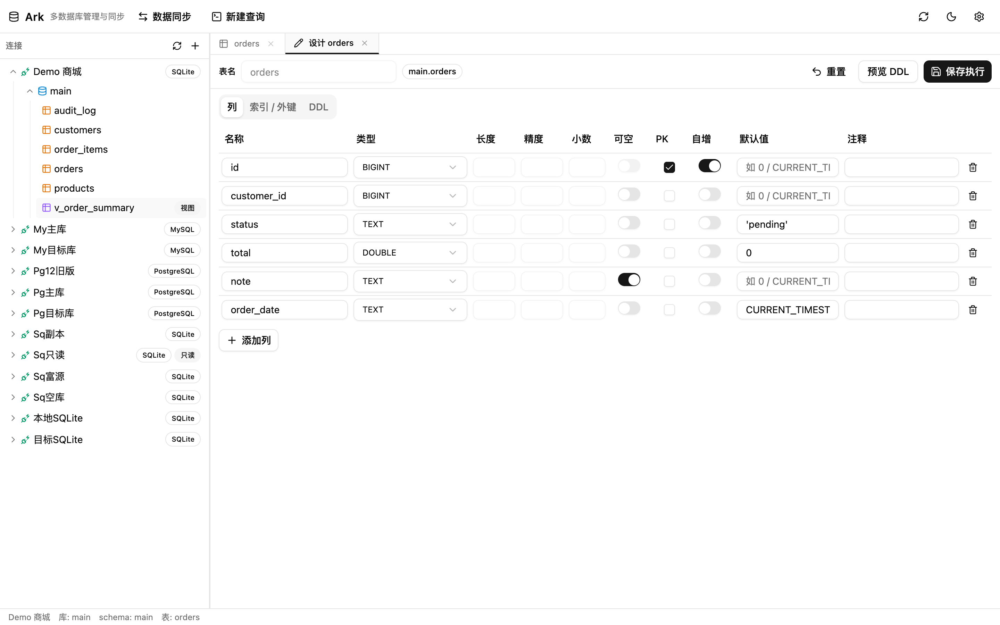
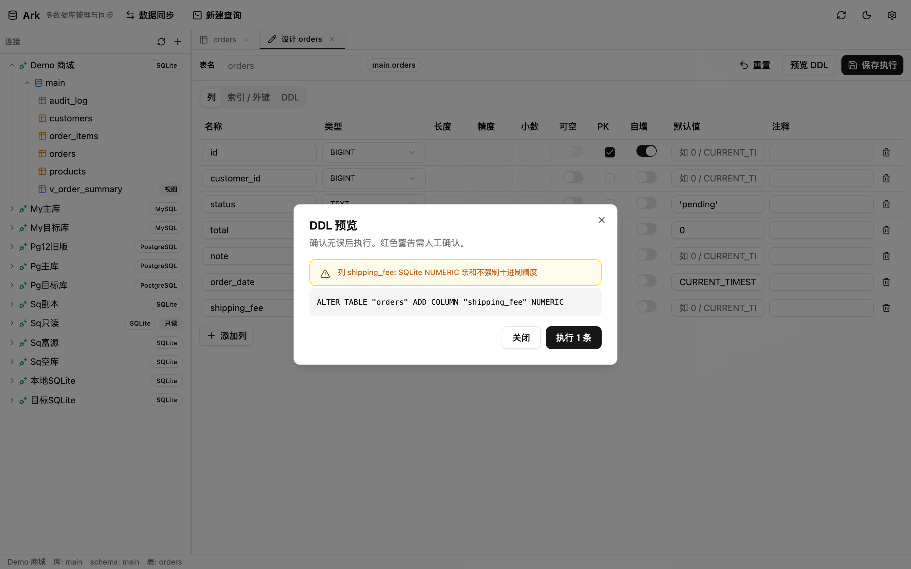

# 教程 4：表结构设计器

右键表 → **设计表**（编辑已有表）；或右键连接/数据库 → **新建表**（从零建表）。两者是同一个界面。

## 1. 界面总览

- 顶部：表名（编辑已有表时不可改名）、「库.表」Badge、**重置**（放弃本次修改）、**预览 DDL**、**保存执行**
- 三个 Tab：
  - **列**：可视化编辑每列的 名称 / 类型 / 长度 / 精度·小数 / 可空 / PK / 自增 / 默认值 / 注释
  - **索引 / 外键**（仅编辑态）：只读展示已有索引（含 UNIQUE 标记、列集）与外键（列 → 引用表(列) · ON DELETE 行为）
  - **DDL**（仅编辑态）：后端返回的建表语句原文

类型下拉提供 **18 种规范类型**（SMALLINT / INT / BIGINT / DECIMAL / FLOAT / DOUBLE / BOOLEAN / CHAR(n) / VARCHAR(n) / TEXT / DATE / TIME / DATETIME / TIMESTAMPTZ / BLOB / UUID / JSON 等），保存时由类型映射层转换为当前方言的实际类型，无法精确映射时会给出降级警告而不是静默处理。

## 2. 修改表结构并预览 DDL

下图演示给 `orders` 表增加一列 `shipping_fee DECIMAL`：

1. 点底部 **＋添加列**，填写列名、选择类型
2. 点 **预览 DDL** —— 生成 ALTER 语句前会先做完整校验

预览对话框包含：

- **警告区**：每条需要人工确认的差异用黄色 Alert 列出。截图中 SQLite 忽略了 DECIMAL 精度（SQLite 类型亲和特性），这就是「降级必须可见」原则的体现
- **语句区**：将执行的 SQL 全文
- **执行 N 条**：确认后真正提交；执行结果以 toast 报告成功/失败条数

## 3. 新建表流程

右键连接/数据库 → **新建表** → 逐列填写 → **预览 DDL**（生成 CREATE TABLE + 索引 + 外键）→ **执行**。

方言细节（自动处理，无需记忆）：

- PostgreSQL：自增用 `GENERATED BY DEFAULT AS IDENTITY`，列注释生成独立 `COMMENT ON COLUMN` 语句
- MySQL：表尾自动追加 `ENGINE=InnoDB CHARSET=utf8mb4 COLLATE=utf8mb4_unicode_ci`；TEXT/BLOB/JSON 列建索引自动加前缀长度
- SQLite：仅「单一整数主键」识别为自增（rowid 语义）

## 已知边界（v1）

- **SQLite 仅支持加列 / 删列 / 改名**；修改列类型、默认值、主键、追加外键均不支持，会提示「需重建表」
- 主键变更只产生警告，需人工处理
- 索引 / 外键**只读展示**，不能在设计器里增删（可通过 SQL 控制台或同步功能处理）
- 生成列（GENERATED）锁定显示「生成列」Badge，不可修改
