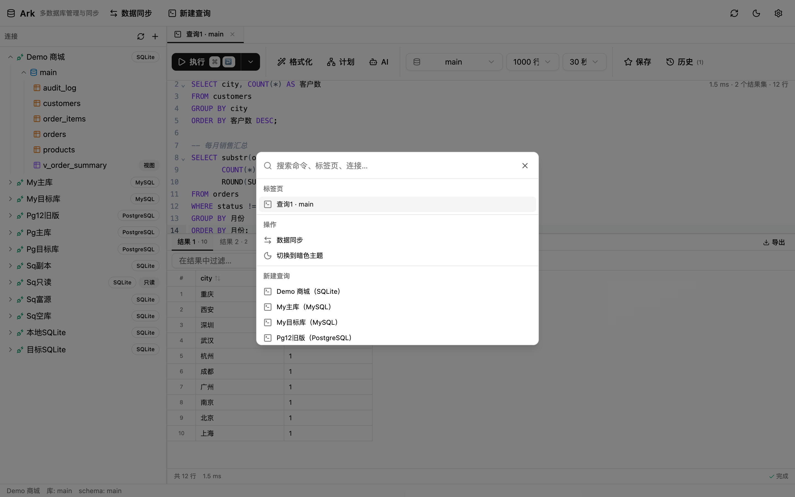
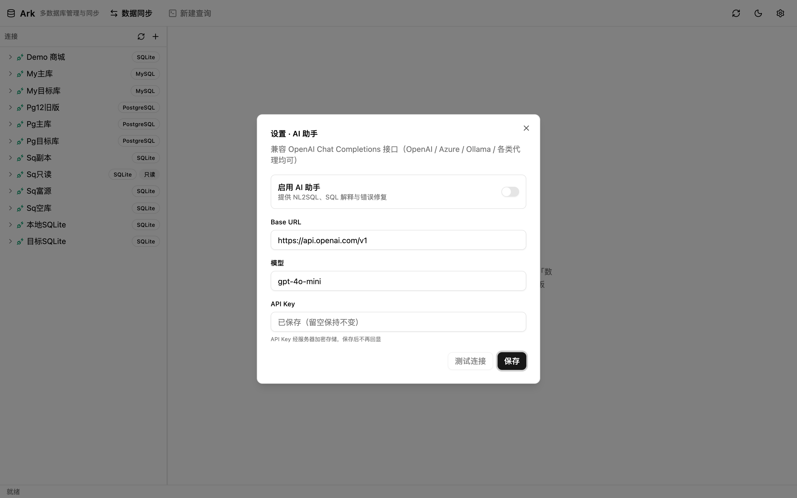

# 教程 8：快捷键、命令面板与设置

## 1. 全局快捷键

| 快捷键 | 范围 | 作用 |
|---|---|---|
| ⌘K / Ctrl+K | 全局 | 打开/关闭命令面板 |
| 鼠标中键 | 标签 | 关闭标签 |

## 2. 命令面板

按 **⌘K**：

- **标签页**：列出所有已打开标签，点击直达
- **操作**：数据同步、切换亮/暗主题
- **新建查询**：按连接列出（带方言标注），回车即在对应连接开新控制台
- 输入即过滤，支持搜索命令、标签页、连接名

## 3. SQL 编辑器快捷键

| 快捷键 | 作用 |
|---|---|
| ⌘/Ctrl + ↩ | 执行选中 / 光标所在语句 |
| ⌘/Ctrl + ⇧ + ↩ | 执行整个脚本 |
| ⇧ ⌥ F | 格式化 SQL（有选区只格式化选区） |
| Ctrl + Space | 手动触发补全（CodeMirror 内置） |
| ⌘/Ctrl + F | 编辑器内搜索 |
| Enter / Esc | 网格单元格编辑：提交 / 取消 |
| ⌘/Ctrl + C | 结果网格选中单元格时复制 |

## 4. 主题

顶栏 **◐** 按钮切换亮 / 暗主题，跟随 `prefers-color-scheme` 初始化，切换即时生效。

## 5. 设置：AI 助手

顶栏 **⚙** 打开设置：

- 打开「**启用 AI 助手**」后，SQL 控制台的 AI 菜单可用（生成 SQL / 解释查询 / 修复错误）
- 兼容 OpenAI Chat Completions 协议，因此 OpenAI / Azure OpenAI / Ollama / 各类代理网关均可接入：
  - **Base URL**：如 `https://api.openai.com/v1`
  - **模型**：如 `gpt-4o-mini`
  - **API Key**：加密存储于服务端，保存后不回显（占位提示「已保存（留空保持不变）」）
- **测试连接**：先保存再连通性测试

调用时后端自动抓取当前连接的表结构（表名/列名/类型），压缩后作为上下文（截断至 8000 字符），因此生成的 SQL 知道你的 schema。AI 未配置时接口返回 6001，菜单置灰并提示先去设置。
